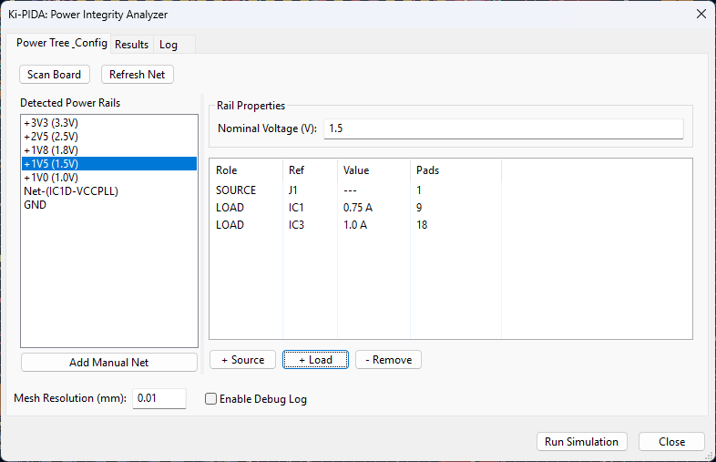
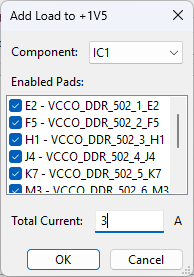
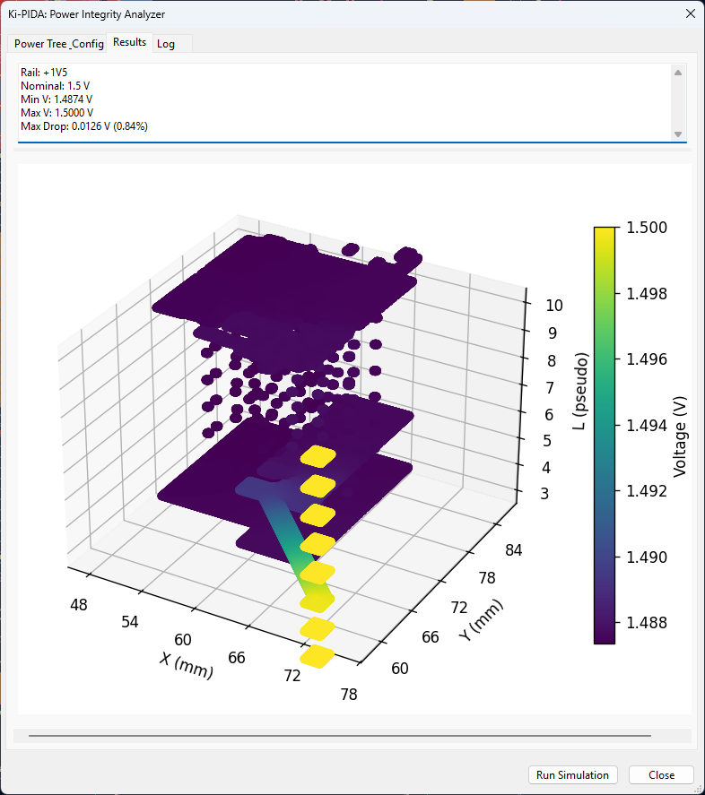

# Ki-PIDA (KiCad Power Integrity & Delivery Analyzer)

Ki-PIDA is a native KiCad plugin designed for Direct Current (DC) Power Integrity (PI) analysis. It allows PCB designers to simulate voltage drops (IR drop), current densities, and thermal rise directly within the KiCad Pcbnew environment, eliminating the need for expensive proprietary tools or complex external workflows.

## 🚀 Why Ki-PIDA?

Modern electronics operate with tight voltage margins. An IR drop of just 30mV can lead to system instability in sub-1.0V Socs. High current densities also pose thermal risks and reliability hazards like electromigration. 

Ki-PIDA democratizes high-end PI analysis by:
- **Ensuring Stability:** Detect voltage violations at the layout stage.
- **Reducing Iterations:** Identify "neck-down" regions and hotspots before prototyping.
- **Seamless Workflow:** Interactive layout-driven analysis without leaving KiCad.

## ✨ Key Features

- **Native Integration:** Built for KiCad 9.0+ using the Python Scripting API.
- **Power Tree Management:** Auto-discover power rails and manage complex hierarchies including VRM efficiency modeling.
- **Hybrid 2.5D Solver:** Fast and accurate simulation using an optimized resistive mesh approach.
- **Multi-Physics Support:** Coupled electro-thermal simulation to account for temperature-dependent copper resistivity.
- **Visual Feedback:** Interactive heatmaps for voltage and current density rendered as overlays on the PCB canvas.

## 📦 Installation

Ki-PIDA is designed to run within the KiCad 9.0+ environment. Follow these steps to install and enable the plugin:

### 1. Enable the KiCad API
Ki-PIDA communicates with KiCad via the new IPC-based API.
1. Open KiCad.
2. Go to **Preferences** > **Common**.
3. Under the **API** section, check the box for **Enable API**.
4. Restart KiCad if prompted.

### 2. Install the Plugin
1. Locate your KiCad plugins directory:
   - **Windows:** `%APPDATA%\kicad\9.0\plugins`
   - **Linux:** `~/.local/share/kicad/9.0/plugins`
   - **macOS:** `~/Library/Application Support/kicad/9.0/plugins`
2. Download or clone this repository.
3. Copy the `KiPIDA` folder into the `plugins` directory.

> [!NOTE]
> Ki-PIDA includes a self-contained dependency manager that will automatically install required libraries (NumPy, SciPy, Shapely, Matplotlib) upon first launch if they are missing from your KiCad Python environment.

---

## 📖 Tutorial: Your First IR Drop Analysis

Follow these steps to perform a DC Power Integrity analysis on your board.

### 1. Launch the Plugin
Open your PCB layout in KiCad Pcbnew and click the **Ki-PIDA** icon in the top toolbar to open the analyzer.

### 2. Review Discovered Power Rails
Upon launch, Ki-PIDA automatically scans your board for likely power rails (based on naming conventions like `+3V3`, `VCC`, `VDD`, `GND`).
- Your identified nets will appear in the **Power Tree & Config** tab.
- **Set Voltage**: Select your net (e.g., `+3V3`). In **Rail Properties**, enter the **Nominal Voltage (V)** (e.g., `3.3`).
- **Manual Addition**: If a specific net was not auto-discovered, click **Add Manual Net** to select it from the full netlist.

### 3. Add Sources (VRMs / Power Inputs)
Identify where power enters this net:
1. Click **+ Source**.
2. Select the source component (e.g., a regulator `U1` or connector `J1`).
3. In the dialog, check the **Pads** that are connected to the power net.
4. Click **OK**.

### 4. Add Loads (Integrated Circuits / Sinks)
Identify the components consuming power:
1. Click **+ Load**.
2. Select the sink component (e.g., MCU `U2` or FPGA `U3`).
3. Enter the **Total Current (A)** consumed by this component (e.g., `0.5` for 500mA).
4. Check the **Pads** through which the current is drawn.
5. Click **OK**.

### 5. Run the Simulation
Before running, you can adjust the **Mesh Resolution (mm)**. A value of `0.1mm` is usually sufficient for accurate results.
- Click **Run Simulation** at the bottom of the window.
- The plugin will automatically switch to the **Log** tab. Wait a few seconds for the mesh generation and solver to complete.

### 6. Analyze Results
Once "Simulation Success" appears, the UI will jump to the **Results** tab.
- **Text Summary**: Look at the top panel for the minimum voltage found on the net and the total percentage drop.
- **Visual Heatmap**: The bottom panel displays a color-coded heatmap overlaid on your board geometry. 
    - **Bright Colors (Red/Yellow)**: Represent areas near the source (nominal voltage).
    - **Cool Colors (Blue/Purple)**: Represent areas with higher voltage drop (lowest voltage).

> [!TIP]
> Use the **Enable Debug Log** checkbox if you encounter issues during meshing or solving to see more detail in the Log tab.

## 🛠️ Technical Overview (For Developers)

Ki-PIDA is built on a modular architecture designed for performance and maintainability.

### Architecture
- **Extractor (`extractor.py`):** Interfaces with the KiCad API to pull filled zone geometry, track layouts, and physical stackup data.
- **Mesher (`mesh.py`):** Discretizes continuous copper geometry into a 2D/3D resistive grid (Rasterization).
- **Solver (`solver.py`):** Uses an Admittance Matrix (Stamps method) and optimized SciPy sparse solvers (SuperLU/CG) to solve the electrical system.
- **Visualizer (`visualizer.py`):** Generates heatmaps via Matplotlib and renders them as overlays in KiCad.

### Methodology
The tool utilizes a **Hybrid 2.5D Finite Difference Method (FDM)**. It represents PCB layers as 2D grids of resistors connected vertically by via/PTH resistor elements. This provides the ideal balance between the speed of a 2D solver and the accuracy of a full 3D FEM for planar PCB structures.

### Stack
- **Languages:** Python 3.9+
- **UI:** wxPython
- **Math:** NumPy & SciPy
- **Geometry:** Shapely

## � Current State (Alpha)

As of the current version, Ki-PIDA implements a functional end-to-end pipeline for DC IR drop analysis.

### Capabilities:
- **Comprehensive Extraction:** Extracts tracks, pads, and filled zones (respecting thermal reliefs and voids) from KiCad 9.0+ boards.
- **3D Meshing Engine:** Converts geometry into a resistive mesh across multiple layers, correctly modeling via and PTH conductances.
- **Robust Linear Solver:** Solves the circuit using SciPy's sparse matrix backend. Includes island detection to warn about floating sections of copper that could cause numerical issues.
- **Automated Diagnostics:** Detects isolated copper nodes and disjoint electrical islands during the solve phase.

### User Experience:
- **Automated Rail Discovery:** Instantly find power nets based on zone connectivity.
- **Granular Control:** Assign sources and loads down to the individual pad level.
- **In-Memory Visualization:** Instant generation of color-coded heatmaps to inspect voltage distribution without exporting files.

## �🗺️ Roadmap

- **Phase 1 (Current):** DC IR Drop, basic thermal checks, and power tree UI.
- **Phase 2:** AC Impedance Analysis ($Z$ vs Frequency) and decoupling capacitor optimization.
- **Phase 3:** Full 3D Thermal modeling with airflow convection.
